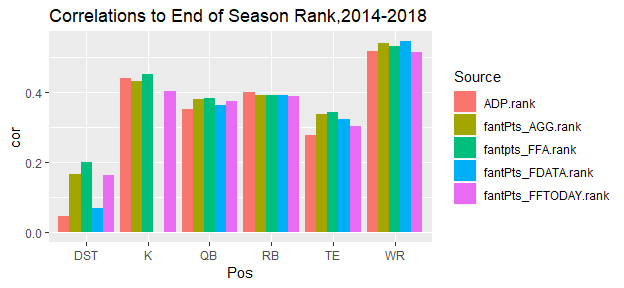
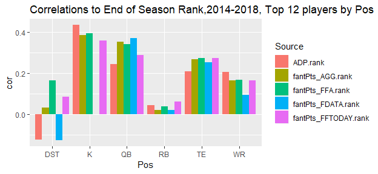
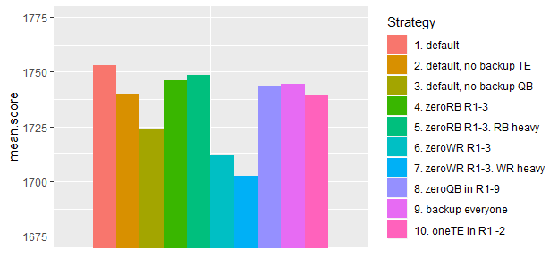
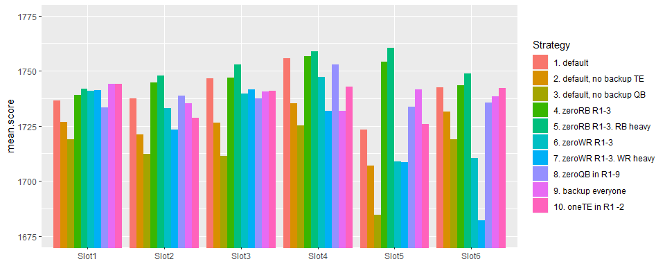
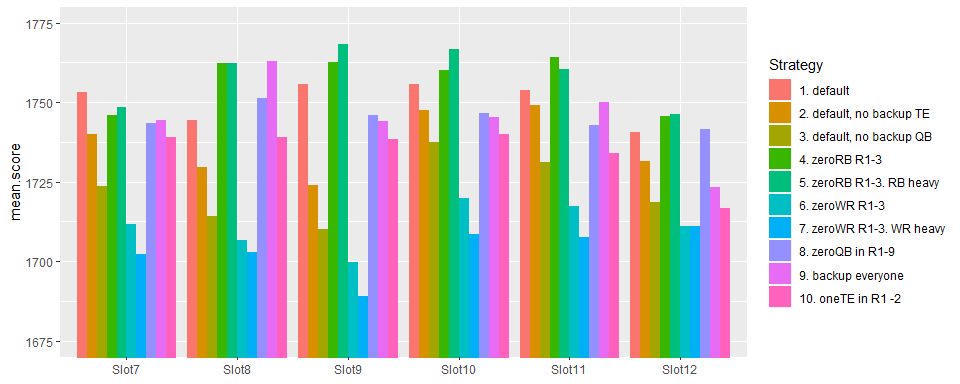

Simulation and Optimization for Fantasy Football Drafts
=======================================================

In this post, I’ll use simulation and optimization to determine which
draft strategies will result in the best lineups for fantasy football.

In fantasy football, there’s a lot to consider when trying to figure out
an optimal draft strategy. For example, WR draft position is more
correlated to their end of season ranking than RB draft position is, so
for that reason, it might make sense to pick WRs first. However, on the
other hand, top RB’s have a higher ceiling and the potential to score
350 points, whereas top WRs can only reach 275 points. Then, the
potential “league-winning” variance/higher projection of RBs may seem to
make them more appealing. Positions like DST, which have low ceiling and
low pre-season correlation seem to be an obvious choice to draft very
late. QBs, on the other hand, which have high ceiling and low
correlation are less clear. There’s a lot of things to consider, and I
haven’t even mentioned other things like how you need to start a
different number of each position. Simulation is a good way to estimate
the effects of different strategies.

   

# 1. Organizing/Plotting the Data

The first thing I’ll do is organize the data. I’m using season
projections from FantasyData.com, fantasyfootballanalytics.net, and
FFToday.com because they have archived projections available. I’m using
Average Draft Position (ADP) data from fantasyfootballcalculator.com
which shows where players were drafted each year. For all of this, I’m
using Half-PPR scoring and Yahoo defaults (1 QB, 2 RB, 2 WR, 1 TE, 1
RB/WR/TE, 1 DST, 1K). To start off I’ll look at some summary stats:

From this chart, you can see that certain players are easier to project.
DST expectedly is very hard to rank preseason so is an obvious candidate
to draft late. WR’s on the other hand seem the easiest to project, and
for all of them the projections seem to have performed similarly to ADP.
AGG.rank is just the mean of the outside ranks. This plot is a bit
unfair though, because positions with a larger sample size will have
their correlation unfairly inflated due to being able to rank further
down into benchwarmer players. I’ll reproduce the plot with the top 12
for each position:

In addition, I’d also like to summarize the errors/variance:

Above I show the distribution of errors for WRs, from 2008-2018. I am
going to use this when I make my draft strategy. I want to know based on
the projection and the Pos, how the error is distributed. Positive error
means they overperformed their projection. Now that the data is prepared
and summarized, I’m ready to test out a system.

   

# 2. Evaluating a Draft Strategy

After preparing the data and organizing estimated projections and
errors, I’m ready to test out draft strategies. I want something [like
this](https://fantasyfootballcalculator.com/draft-strategy/half-ppr/12-team/7-spot),
which shows how a different strategy in R1-3 will affect a draft’s
projected points. This is meant to let you to see what positions you
should wait on drafting if you want to maximize your points. The thing
that isn’t accounted for in the above link though, is that you are not
trying to maximize projected points of a full draft, but rather for your
eventual starting lineup, so you’re trying to pick the draft that will
give you the best nine players.

To do this, my methodology consists of two functions: getPicks() and
simSeason(): - getPicks() takes in parameters like the slot you are
drafting at, numRBs to draft, numWR to draft, and you can fix/exclude
players or positions for each round as well. It then returns the draft
which maximizes total points of the whole, given the specified
parameters and draft-position constraints. I show an example below,
maximizing the points for Slot7/12 in a 15 round draft.

    picks<-getPicks(slot="Slot7", data=all.data[all.data$Season==2019,], numTeams = 12,
                    numRB=4, numWR = 5,numTE=2,numQB=2,numK=1, numDST=1)

<table class="table table-striped table-hover table-condensed table-responsive" style="margin-left: auto; margin-right: auto;">
<thead>
<tr>
<th style="text-align:left;">
Player
</th>
<th style="text-align:left;">
Pos
</th>
<th style="text-align:left;">
Team
</th>
<th style="text-align:right;">
ADP\_half
</th>
<th style="text-align:right;">
ADP.Rank
</th>
<th style="text-align:right;">
fantPts\_AGG
</th>
<th style="text-align:left;">
fantPts\_AGG.bin
</th>
<th style="text-align:right;">
Slot
</th>
</tr>
</thead>
<tbody>
<tr>
<td style="text-align:left;">
Julio Jones
</td>
<td style="text-align:left;">
WR
</td>
<td style="text-align:left;">
Atl
</td>
<td style="text-align:right;">
10.9
</td>
<td style="text-align:right;">
11.0
</td>
<td style="text-align:right;">
260.55
</td>
<td style="text-align:left;">
(250,400\]
</td>
<td style="text-align:right;">
7
</td>
</tr>
<tr>
<td style="text-align:left;">
Dalvin Cook
</td>
<td style="text-align:left;">
RB
</td>
<td style="text-align:left;">
Min
</td>
<td style="text-align:right;">
17.4
</td>
<td style="text-align:right;">
18.0
</td>
<td style="text-align:right;">
224.20
</td>
<td style="text-align:left;">
(200,250\]
</td>
<td style="text-align:right;">
18
</td>
</tr>
<tr>
<td style="text-align:left;">
Julian Edelman
</td>
<td style="text-align:left;">
WR
</td>
<td style="text-align:left;">
Nwe
</td>
<td style="text-align:right;">
39.4
</td>
<td style="text-align:right;">
40.0
</td>
<td style="text-align:right;">
204.80
</td>
<td style="text-align:left;">
(200,250\]
</td>
<td style="text-align:right;">
31
</td>
</tr>
<tr>
<td style="text-align:left;">
Phillip Lindsay
</td>
<td style="text-align:left;">
RB
</td>
<td style="text-align:left;">
Den
</td>
<td style="text-align:right;">
41.8
</td>
<td style="text-align:right;">
42.0
</td>
<td style="text-align:right;">
195.55
</td>
<td style="text-align:left;">
(150,200\]
</td>
<td style="text-align:right;">
42
</td>
</tr>
<tr>
<td style="text-align:left;">
Deshaun Watson
</td>
<td style="text-align:left;">
QB
</td>
<td style="text-align:left;">
Hou
</td>
<td style="text-align:right;">
54.6
</td>
<td style="text-align:right;">
56.0
</td>
<td style="text-align:right;">
328.92
</td>
<td style="text-align:left;">
(250,400\]
</td>
<td style="text-align:right;">
55
</td>
</tr>
<tr>
<td style="text-align:left;">
James White
</td>
<td style="text-align:left;">
RB
</td>
<td style="text-align:left;">
Nwe
</td>
<td style="text-align:right;">
64.2
</td>
<td style="text-align:right;">
67.0
</td>
<td style="text-align:right;">
178.70
</td>
<td style="text-align:left;">
(150,200\]
</td>
<td style="text-align:right;">
66
</td>
</tr>
<tr>
<td style="text-align:left;">
Lesean Mccoy
</td>
<td style="text-align:left;">
RB
</td>
<td style="text-align:left;">
Buf
</td>
<td style="text-align:right;">
92.2
</td>
<td style="text-align:right;">
95.0
</td>
<td style="text-align:right;">
149.75
</td>
<td style="text-align:left;">
(100,150\]
</td>
<td style="text-align:right;">
79
</td>
</tr>
<tr>
<td style="text-align:left;">
Chi
</td>
<td style="text-align:left;">
DST
</td>
<td style="text-align:left;">
Chi
</td>
<td style="text-align:right;">
92.7
</td>
<td style="text-align:right;">
96.0
</td>
<td style="text-align:right;">
122.00
</td>
<td style="text-align:left;">
(100,150\]
</td>
<td style="text-align:right;">
90
</td>
</tr>
<tr>
<td style="text-align:left;">
Corey Davis
</td>
<td style="text-align:left;">
WR
</td>
<td style="text-align:left;">
Ten
</td>
<td style="text-align:right;">
100.9
</td>
<td style="text-align:right;">
105.0
</td>
<td style="text-align:right;">
145.20
</td>
<td style="text-align:left;">
(100,150\]
</td>
<td style="text-align:right;">
103
</td>
</tr>
<tr>
<td style="text-align:left;">
Dede Westbrook
</td>
<td style="text-align:left;">
WR
</td>
<td style="text-align:left;">
Jax
</td>
<td style="text-align:right;">
114.1
</td>
<td style="text-align:right;">
120.0
</td>
<td style="text-align:right;">
134.65
</td>
<td style="text-align:left;">
(100,150\]
</td>
<td style="text-align:right;">
114
</td>
</tr>
<tr>
<td style="text-align:left;">
Dak Prescott
</td>
<td style="text-align:left;">
QB
</td>
<td style="text-align:left;">
Dal
</td>
<td style="text-align:right;">
144.1
</td>
<td style="text-align:right;">
147.0
</td>
<td style="text-align:right;">
296.65
</td>
<td style="text-align:left;">
(250,400\]
</td>
<td style="text-align:right;">
127
</td>
</tr>
<tr>
<td style="text-align:left;">
Greg Zuerlein
</td>
<td style="text-align:left;">
K
</td>
<td style="text-align:left;">
Lar
</td>
<td style="text-align:right;">
146.7
</td>
<td style="text-align:right;">
151.0
</td>
<td style="text-align:right;">
143.00
</td>
<td style="text-align:left;">
(100,150\]
</td>
<td style="text-align:right;">
138
</td>
</tr>
<tr>
<td style="text-align:left;">
Greg Olsen
</td>
<td style="text-align:left;">
TE
</td>
<td style="text-align:left;">
Car
</td>
<td style="text-align:right;">
150.8
</td>
<td style="text-align:right;">
160.0
</td>
<td style="text-align:right;">
117.60
</td>
<td style="text-align:left;">
(100,150\]
</td>
<td style="text-align:right;">
151
</td>
</tr>
<tr>
<td style="text-align:left;">
Kyle Rudolph
</td>
<td style="text-align:left;">
TE
</td>
<td style="text-align:left;">
Min
</td>
<td style="text-align:right;">
157.2
</td>
<td style="text-align:right;">
172.5
</td>
<td style="text-align:right;">
119.55
</td>
<td style="text-align:left;">
(100,150\]
</td>
<td style="text-align:right;">
162
</td>
</tr>
<tr>
<td style="text-align:left;">
Mohamed Sanu
</td>
<td style="text-align:left;">
WR
</td>
<td style="text-align:left;">
Atl
</td>
<td style="text-align:right;">
NA
</td>
<td style="text-align:right;">
500.0
</td>
<td style="text-align:right;">
128.55
</td>
<td style="text-align:left;">
(100,150\]
</td>
<td style="text-align:right;">
175
</td>
</tr>
</tbody>
</table>
Above I display the optimal planned-draft given my parameters. You can
see how each player’s ADP.Rank must be greater than or equal to the slot
you are drafting at.

 

The second function is simSeason() which takes in the planned-draft from
getPicks(), and using the errors from earlier, samples from the errors
in the player’s corresponding position/bin to get a simulated score for
each drafted player. Using this, I can sort by simulated score to get
the starting lineup. You only can put 9 players in your starting lineup
and so if you have 2 amazing QBs, only 1 will get into your simulated
starting lineup. In addition, I also simulate the scores of the
undrafted players, and I assume you are able to add the 4th-best
simulated undrafted player at each position. I made this assumption
because it is likely you will be lacking at 1-2 positions and so will be
able to get a decent player as a pickup for those positions.

Below you can see an example using the above picks:

    set.seed(1)
    topLineup<-simSeason(picks = picks, data=all.data, numSims=1,
                         numRB = 2, numWR=2, numFLEX = 1,  numQB=1, numTE = 1, numDST = 1, numK = 1   )

<table class="table table-striped table-hover table-condensed table-responsive" style="margin-left: auto; margin-right: auto;">
<thead>
<tr>
<th style="text-align:left;">
Player
</th>
<th style="text-align:left;">
Pos
</th>
<th style="text-align:left;">
Team
</th>
<th style="text-align:right;">
ADP\_half
</th>
<th style="text-align:right;">
ADP.Rank
</th>
<th style="text-align:right;">
fantPts\_AGG
</th>
<th style="text-align:left;">
fantPts\_AGG.bin
</th>
<th style="text-align:right;">
Slot
</th>
<th style="text-align:right;">
error
</th>
<th style="text-align:right;">
Sim
</th>
<th style="text-align:right;">
Pickup
</th>
</tr>
</thead>
<tbody>
<tr>
<td style="text-align:left;">
Deshaun Watson
</td>
<td style="text-align:left;">
QB
</td>
<td style="text-align:left;">
Hou
</td>
<td style="text-align:right;">
54.6
</td>
<td style="text-align:right;">
56
</td>
<td style="text-align:right;">
328.92
</td>
<td style="text-align:left;">
(250,400\]
</td>
<td style="text-align:right;">
55
</td>
<td style="text-align:right;">
27.730
</td>
<td style="text-align:right;">
356.650
</td>
<td style="text-align:right;">
0
</td>
</tr>
<tr>
<td style="text-align:left;">
Julio Jones
</td>
<td style="text-align:left;">
WR
</td>
<td style="text-align:left;">
Atl
</td>
<td style="text-align:right;">
10.9
</td>
<td style="text-align:right;">
11
</td>
<td style="text-align:right;">
260.55
</td>
<td style="text-align:left;">
(250,400\]
</td>
<td style="text-align:right;">
7
</td>
<td style="text-align:right;">
19.683
</td>
<td style="text-align:right;">
280.233
</td>
<td style="text-align:right;">
0
</td>
</tr>
<tr>
<td style="text-align:left;">
Lesean Mccoy
</td>
<td style="text-align:left;">
RB
</td>
<td style="text-align:left;">
Buf
</td>
<td style="text-align:right;">
92.2
</td>
<td style="text-align:right;">
95
</td>
<td style="text-align:right;">
149.75
</td>
<td style="text-align:left;">
(100,150\]
</td>
<td style="text-align:right;">
79
</td>
<td style="text-align:right;">
107.307
</td>
<td style="text-align:right;">
257.057
</td>
<td style="text-align:right;">
0
</td>
</tr>
<tr>
<td style="text-align:left;">
Julian Edelman
</td>
<td style="text-align:left;">
WR
</td>
<td style="text-align:left;">
Nwe
</td>
<td style="text-align:right;">
39.4
</td>
<td style="text-align:right;">
40
</td>
<td style="text-align:right;">
204.80
</td>
<td style="text-align:left;">
(200,250\]
</td>
<td style="text-align:right;">
31
</td>
<td style="text-align:right;">
24.566
</td>
<td style="text-align:right;">
229.366
</td>
<td style="text-align:right;">
0
</td>
</tr>
<tr>
<td style="text-align:left;">
Greg Olsen
</td>
<td style="text-align:left;">
TE
</td>
<td style="text-align:left;">
Car
</td>
<td style="text-align:right;">
150.8
</td>
<td style="text-align:right;">
160
</td>
<td style="text-align:right;">
117.60
</td>
<td style="text-align:left;">
(100,150\]
</td>
<td style="text-align:right;">
151
</td>
<td style="text-align:right;">
89.385
</td>
<td style="text-align:right;">
206.985
</td>
<td style="text-align:right;">
0
</td>
</tr>
<tr>
<td style="text-align:left;">
Phillip Lindsay
</td>
<td style="text-align:left;">
RB
</td>
<td style="text-align:left;">
Den
</td>
<td style="text-align:right;">
41.8
</td>
<td style="text-align:right;">
42
</td>
<td style="text-align:right;">
195.55
</td>
<td style="text-align:left;">
(150,200\]
</td>
<td style="text-align:right;">
42
</td>
<td style="text-align:right;">
7.255
</td>
<td style="text-align:right;">
202.805
</td>
<td style="text-align:right;">
0
</td>
</tr>
<tr>
<td style="text-align:left;">
James White
</td>
<td style="text-align:left;">
RB
</td>
<td style="text-align:left;">
Nwe
</td>
<td style="text-align:right;">
64.2
</td>
<td style="text-align:right;">
67
</td>
<td style="text-align:right;">
178.70
</td>
<td style="text-align:left;">
(150,200\]
</td>
<td style="text-align:right;">
66
</td>
<td style="text-align:right;">
-34.827
</td>
<td style="text-align:right;">
143.873
</td>
<td style="text-align:right;">
0
</td>
</tr>
<tr>
<td style="text-align:left;">
Ten
</td>
<td style="text-align:left;">
DST
</td>
<td style="text-align:left;">
Ten
</td>
<td style="text-align:right;">
NA
</td>
<td style="text-align:right;">
500
</td>
<td style="text-align:right;">
92.00
</td>
<td style="text-align:left;">
(0,100\]
</td>
<td style="text-align:right;">
NA
</td>
<td style="text-align:right;">
50.667
</td>
<td style="text-align:right;">
142.667
</td>
<td style="text-align:right;">
1
</td>
</tr>
<tr>
<td style="text-align:left;">
Greg Zuerlein
</td>
<td style="text-align:left;">
K
</td>
<td style="text-align:left;">
Lar
</td>
<td style="text-align:right;">
146.7
</td>
<td style="text-align:right;">
151
</td>
<td style="text-align:right;">
143.00
</td>
<td style="text-align:left;">
(100,150\]
</td>
<td style="text-align:right;">
138
</td>
<td style="text-align:right;">
-4.000
</td>
<td style="text-align:right;">
139.000
</td>
<td style="text-align:right;">
0
</td>
</tr>
</tbody>
</table>
You can see from “error”, which players over and underperformed in the
sim, sampling the error from 2008-2018 data. Additionally, in the above
sim you see how Tennessee DST made it into the top starting lineup as a
pickup. Finally, I can repeat simseason() many times, and so can get a
mean simulated-lineup-total-score for the planned picks. I used 2000 as
my simulation size as it seemed sufficient for the mean to converge.

    topLineups<-simSeason(picks = picks, data=all.data, numSims=2000,
                          numRB = 2, numWR=2, numFLEX = 1,
                          numQB=1, numTE = 1, numDST = 1, numK = 1   )
    summary(sapply(topLineups, function(x) sum(x$Sim)))

    ##    Min. 1st Qu.  Median    Mean 3rd Qu.    Max. 
    ##    1374    1666    1752    1756    1840    2237

   

# 3. Parameter Optimization

Now I’m ready to test different getPicks() parameters to see how I
should do my draft to get my the best mean-starting lineup. I included
arguments in the getPicks() function such as onePos and outPos which can
allow me to force positions in/out of rounds and experiment with
strategies like “have exactly one TE in Rounds 1-2” or “exactly zero RB
in Rounds 1-4”, or other things. I test out several parameter
combinations below for the 7th slot of a 12 team, 15 round draft.

And below is the detailed parameter info for each strategy:

<table class="table table-striped table-hover table-condensed table-responsive" style="margin-left: auto; margin-right: auto;">
<thead>
<tr>
<th style="text-align:right;">
Strategy.ID
</th>
<th style="text-align:right;">
numRB
</th>
<th style="text-align:right;">
numWR
</th>
<th style="text-align:right;">
numTE
</th>
<th style="text-align:right;">
numQB
</th>
<th style="text-align:right;">
numK
</th>
<th style="text-align:right;">
numDST
</th>
<th style="text-align:left;">
Constraints.Comments
</th>
</tr>
</thead>
<tbody>
<tr>
<td style="text-align:right;">
1
</td>
<td style="text-align:right;">
4
</td>
<td style="text-align:right;">
5
</td>
<td style="text-align:right;">
2
</td>
<td style="text-align:right;">
2
</td>
<td style="text-align:right;">
1
</td>
<td style="text-align:right;">
1
</td>
<td style="text-align:left;">
default
</td>
</tr>
<tr>
<td style="text-align:right;">
2
</td>
<td style="text-align:right;">
5
</td>
<td style="text-align:right;">
5
</td>
<td style="text-align:right;">
1
</td>
<td style="text-align:right;">
2
</td>
<td style="text-align:right;">
1
</td>
<td style="text-align:right;">
1
</td>
<td style="text-align:left;">
default, no backup TE
</td>
</tr>
<tr>
<td style="text-align:right;">
3
</td>
<td style="text-align:right;">
5
</td>
<td style="text-align:right;">
5
</td>
<td style="text-align:right;">
2
</td>
<td style="text-align:right;">
1
</td>
<td style="text-align:right;">
1
</td>
<td style="text-align:right;">
1
</td>
<td style="text-align:left;">
default, no backup QB
</td>
</tr>
<tr>
<td style="text-align:right;">
4
</td>
<td style="text-align:right;">
5
</td>
<td style="text-align:right;">
4
</td>
<td style="text-align:right;">
2
</td>
<td style="text-align:right;">
2
</td>
<td style="text-align:right;">
1
</td>
<td style="text-align:right;">
1
</td>
<td style="text-align:left;">
zeroRB R1-3
</td>
</tr>
<tr>
<td style="text-align:right;">
5
</td>
<td style="text-align:right;">
6
</td>
<td style="text-align:right;">
3
</td>
<td style="text-align:right;">
2
</td>
<td style="text-align:right;">
2
</td>
<td style="text-align:right;">
1
</td>
<td style="text-align:right;">
1
</td>
<td style="text-align:left;">
zeroRB R1-3. RB heavy
</td>
</tr>
<tr>
<td style="text-align:right;">
6
</td>
<td style="text-align:right;">
4
</td>
<td style="text-align:right;">
5
</td>
<td style="text-align:right;">
2
</td>
<td style="text-align:right;">
2
</td>
<td style="text-align:right;">
1
</td>
<td style="text-align:right;">
1
</td>
<td style="text-align:left;">
zeroWR R1-3
</td>
</tr>
<tr>
<td style="text-align:right;">
7
</td>
<td style="text-align:right;">
3
</td>
<td style="text-align:right;">
6
</td>
<td style="text-align:right;">
2
</td>
<td style="text-align:right;">
2
</td>
<td style="text-align:right;">
1
</td>
<td style="text-align:right;">
1
</td>
<td style="text-align:left;">
zeroWR R1-3. WR heavy
</td>
</tr>
<tr>
<td style="text-align:right;">
8
</td>
<td style="text-align:right;">
4
</td>
<td style="text-align:right;">
5
</td>
<td style="text-align:right;">
2
</td>
<td style="text-align:right;">
2
</td>
<td style="text-align:right;">
1
</td>
<td style="text-align:right;">
1
</td>
<td style="text-align:left;">
zeroQB in R1-9
</td>
</tr>
<tr>
<td style="text-align:right;">
9
</td>
<td style="text-align:right;">
3
</td>
<td style="text-align:right;">
4
</td>
<td style="text-align:right;">
2
</td>
<td style="text-align:right;">
2
</td>
<td style="text-align:right;">
2
</td>
<td style="text-align:right;">
2
</td>
<td style="text-align:left;">
backup everyone
</td>
</tr>
<tr>
<td style="text-align:right;">
10
</td>
<td style="text-align:right;">
4
</td>
<td style="text-align:right;">
5
</td>
<td style="text-align:right;">
2
</td>
<td style="text-align:right;">
2
</td>
<td style="text-align:right;">
1
</td>
<td style="text-align:right;">
1
</td>
<td style="text-align:left;">
oneTE in R1 -2
</td>
</tr>
</tbody>
</table>
<!-- 
 -->
<!-- 
 -->
Based on the above, you can see how certain strategies don’t really make
a difference, and certain ones perform worse. For example the zero-WR
strategies (6 & 7) perform about 50 points worse than the default
strategy. Not taking a backup TE and QB also worsen the score.

   

Finally, I reproduce this for all draft slots. Below you can see the
results, and how the best strategy is affected by your draft slot.

 

The above plots are a bit messy, but if you look closely you can see
certain things that seem to make a difference. The 2nd and 3rd
strategies–not taking a backup QB and not taking a backup TE have a
negative effect, as the waiver wire adds apparently are not sufficient
backup. In addition, across the board zero-RB(4&5) seems to perform as
good as, or better than zero-WR (6&7). This is especially true in the
mid-late slots where it seems like the zero-RB does much worse.

This is just for Half-PPR 12 man leagues, and the results might change
with different scoring but it at least is an attempt to quantitatively
evaluate strategies.

   

# 4. Conclusion

Looking at the strategies, many of them perform similarly, finishing
within 10-20 points. A couple did do worse, for example the zero-WR does
considerably worse than zero-RB for people with mid-late slots in the
draft. For these people, zero-WR in R1-3 often performed 50 points worse
than a zero-RB in it’s mean simulated starting lineup, which is
basically like drafting Derrick Henry over Melvin Gordon in R1, and so
it isn’t insignificant. If a league requires 3 WRs to start then this
early RB likely strategy becomes even worse. Other parameter changes
like taking backup TE/QBs also have a decent 10-20 point impact across
draft slots.

Another takeaway is that projections have been about as accurate as ADP.
People often assume analytics will automatically give them an edge, but
often times public consensus or human rankings can be as accurate or
more accurate than an analytical model. I wouldn’t just go by a
projection model or trust someone until I’ve seen it is proven to be
useful. For this post, the projections seemed similar to ADP so I felt
ok using them as the basis. WRs do appear to be somewhat easier and so
it might make sense to work on a model for them or find someone who has
an accurate one.

Finally, there are a couple shortcomings with my method. Firstly, I am
not accounting for opponent probabilistic picking i.e. the fact that you
don’t know exactly where a player will be picked. For simplicity I left
this out. I think estimating a single draft like I did at least shows
you things like the effect of going RB early and WR late, and keeps it
simpler, despite the available players not being exact. Accounting for
this though would be complicated as I’d have to return a set of
potential drafts with getPicks() instead of a single draft, so I wanted
to keep it simple for now.

The second main shortcoming I think is that the optimal strategy
determined by the system will be dependent on the projections. For
example, if there is a WR that is projected as hugely undervalued in the
10th round, then doing a WR early-RB late strategy will look bad because
I am missing out on that value. I think this is something I should look
into. Having said that, things like taking a backup QB/TE do seem like
they’d be less affected by this. An interesting idea would be to create
an entirely ADP-based projection model so that I can see how the optimal
strategy would be regardless of projection system i.e. if there are no
sleepers.

TLDR: Most strategies did similarly. It does seem that you should take a
backup TE and QB. In addition, zero-WR strategy does not seem like a
good move, especially if you are in the mid-late picks of the draft.
Other than that I haven’t found any shocking secrets yet that will give
me a huge edge, though it’s possible I just didn’t test the right
strategies yet. Thanks for reading!
