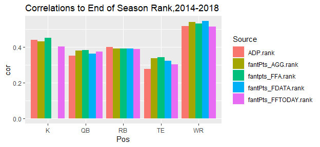
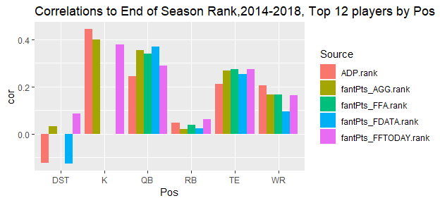
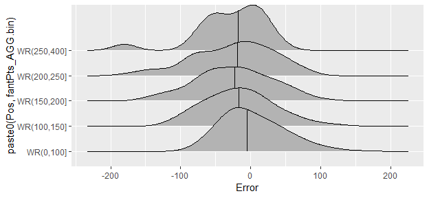
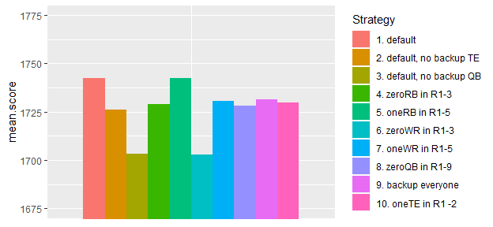
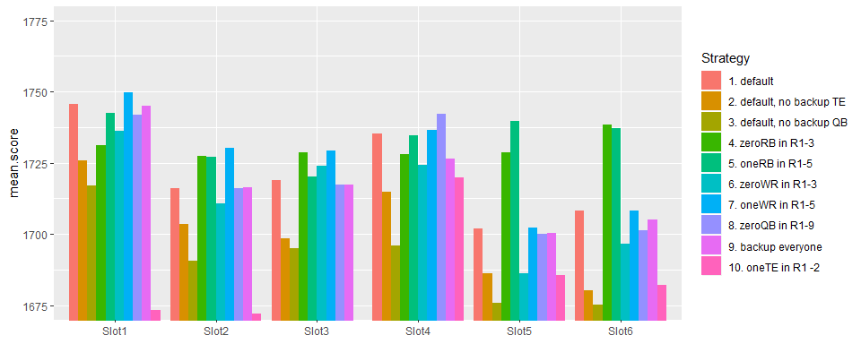
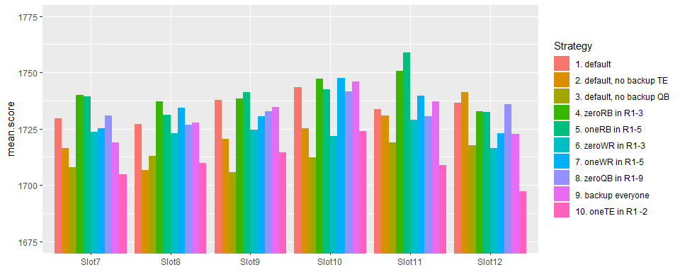

# Simulation and Optimization for Fantasy Football Drafts

In this post, I’ll use simulation and optimization to determine which
draft strategies will result in the best lineups for fantasy football.

In fantasy football, there’s a lot to consider when trying to figure out
an optimal draft strategy. Top RB’s have a high ceiling and the
potential to score 350 points, whereas top WRs can only reach 275
points, however top WR’s are usually seen as safer as they have a higher
correlation of their preseason to end of season rank. Positions like
DST, which have low ceiling and low pre-season correlation seem to be an
obvious choice to draft very late. There’s a lot of things to consider,
and I haven’t even mentioned other things like how you need to start a
different number of each position. Simulation is a good way to estimate
the effects of different strategies.

</br> </br>

## 1\. Organizing/Plotting the Data

The first thing I’ll do is organize/plot the data. I’m using season
projections from FantasyData.com, fantasyfootballanalytics.net, and
FFToday.com because they have archived projections available. I’m using
Average Draft Position (ADP) data from fantasyfootballcalculator.com
which shows where players were drafted each year. For all of this, I’m
using Half-PPR scoring and Yahoo defaults (1 QB, 2 RB, 2 WR, 1 TE, 1
RB/WR/TE, 1 DST, 1K). To start off I’ll look at some summary stats:

<!-- -->

From this chart, you can see that certain positions are easier to
project. DST expectedly is very hard to rank preseason so is an obvious
candidate to draft late. You can also see that the outside ranks have
similar predictive accuracy to ADP.Rank. AGG.rank is just the mean of
the outside ranks. This plot is a bit unfair though, because positions
with a larger sample size will have their correlation unfairly inflated
due to being able to rank further down into benchwarmer players. I’ll
reproduce the plot with the top 12 for each position:

<!-- -->

In addition, I’d also like to summarize the errors/variance:

<!-- -->

Above I show the distribution of errors for WRs, from 2008-2018. I am
going to use this when I make my draft strategy. I want to know based on
the projection and the Pos, how the error is distributed. Positive error
means they overperformed their projection. Now that the data is prepared
and summarized, I’m ready to test out a system.

</br> </br>

## 2\. Evaluating a Draft Strategy

After preparing the data and organizing estimated projections and
errors, I’m ready to test out draft strategies. I want something [like
this](https://fantasyfootballcalculator.com/draft-strategy/half-ppr/12-team/7-spot),
which shows how a different strategy in R1-3 will affect a draft’s
projected points. This is meant to let you see what positions you should
wait on drafting if you want to maximize your points. The thing that
isn’t accounted for in the above link though, is that in reality you
are not trying to maximize projected points of a full draft, but rather
for your eventual starting lineup, so you’re trying to pick the draft
that will give you the best eventual nine players.

My methodology consists of two functions: getPicks() and simSeason().

getPicks() takes in parameters like the slot you are drafting at, numRBs
to draft, numWR to draft, and you can fix/exclude players or positions
for each round as well. It then returns the draft which maximizes total
points of all the picks, given the specified parameters and
draft-position constraints. I show an example below, maximizing the
points for Slot7/12 in a 15 round
draft.

``` r
picks<-getPicks(slot="Slot7", data=all.data[all.data$Season==2019,], numTeams = 12,
                numRB=4, numWR = 5,numTE=2,numQB=2,numK=1, numDST=1)
```

    ##                Player Pos Team ADP_half ADP.Rank fantPts_AGG fantPts_AGG.bin Slot
    ## 10727     Julio Jones  WR  Atl     11.0     11.0    260.6014       (250,400]    7
    ## 10734     Todd Gurley  RB  Lar     17.0     18.0    230.9717       (200,250]   18
    ## 10752   George Kittle  TE  Sfo     33.3     36.0    193.4550       (150,200]   31
    ## 10759 Phillip Lindsay  RB  Den     42.6     43.0    193.0022       (150,200]   42
    ## 10779     James White  RB  Nwe     62.2     63.0    173.3381       (150,200]   55
    ## 10789  Alshon Jeffery  WR  Phi     71.7     73.0    169.2632       (150,200]   66
    ## 10798  Allen Robinson  WR  Chi     80.0     82.0    157.8520       (150,200]   79
    ## 10824     Corey Davis  WR  Ten    105.9    108.0    153.1803       (150,200]   90
    ## 10827    Lesean Mccoy  RB  Buf    108.2    110.5    146.5663       (100,150]  103
    ## 10830  Jameis Winston  QB  Tam    111.8    114.0    297.6446       (250,400]  114
    ## 10845             Bal DST  Bal    124.6    129.0    110.0000       (100,150]  127
    ## 10854    Dak Prescott  QB  Dal    131.9    138.0    296.9355       (250,400]  138
    ## 10867   Greg Zuerlein   K  Lar    147.2    151.5    123.1068       (100,150]  151
    ## 10890    Kyle Rudolph  TE  Min    159.6    174.0    118.2575       (100,150]  162
    ## 11107    Mohamed Sanu  WR  Atl       NA    500.0    131.2559       (100,150]  175

Above I display the optimal planned-draft given my parameters. You can
see how each player’s ADP.Rank must be greater than or equal to the slot
they are drafted at. </br>

The second function is simSeason() which takes in the above
planned-draft from getPicks(), and using the errors from earlier,
samples from the errors in the player’s corresponding
position/projection-bin to get a simulated score. Using this, I can then
sort by simulated score to get the starting lineup from my draft. You
only can put 9 players in your starting lineup and so if you have 2
amazing QBs in the simulated scores, only 1 will get into your simulated
starting lineup. In addition, I also simulate the scores of the
undrafted players, and I assume you are able to add the 4th-best
simulated undrafted player at each position. I made this assumption
because it is likely you will be lacking at 1-2 positions and so will be
able to get a decent player as a pickup for those positions.

Below you can see an example using the above picks:

``` r
set.seed(1)
topLineup<-simSeason(picks = picks, data=all.data, numSims=1,
                     numRB = 2, numWR=2, numFLEX = 1,  numQB=1, numTE = 1, numDST = 1, numK = 1   )
```

    ##             Player Pos Team ADP_half ADP.Rank fantPts_AGG fantPts_AGG.bin Slot      error      Sim Pickup
    ## 12    Dak Prescott  QB  Dal    131.9    138.0    296.9355       (250,400]  138  -5.942500 290.9930      0
    ## 1      Julio Jones  WR  Atl     11.0     11.0    260.6014       (250,400]    7  19.683333 280.2847      0
    ## 8      Corey Davis  WR  Ten    105.9    108.0    153.1803       (150,200]   90 106.528507 259.7088      0
    ## 4  Phillip Lindsay  RB  Den     42.6     43.0    193.0022       (150,200]   42   7.255476 200.2577      0
    ## 3    George Kittle  TE  Sfo     33.3     36.0    193.4550       (150,200]   31   3.537667 196.9927      0
    ## 9     Lesean Mccoy  RB  Buf    108.2    110.5    146.5663       (100,150]  103   2.115981 148.6822      0
    ## 13   Greg Zuerlein   K  Lar    147.2    151.5    123.1068       (100,150]  151  16.114583 139.2214      0
    ## 18     Chris Hogan  WR  Car       NA    500.0     65.1050         (0,100]   NA  66.172444 131.2774      1
    ## 20             Nyg DST  Nyg       NA    500.0     81.0000         (0,100]   NA  27.000000 108.0000      1

You can see from “error”, which players over and underperformed in the
sim, sampling the error from 2008-2018 data. Additionally, in the above
sim you see how a player can make it into the top starting lineup as a
pickup if their simmed score was better than a drafted player. I can now
repeat simseason() many times, and so can get a mean
simulated-lineup-total-score for the planned picks. I used 2000 as my
simulation size as it seemed sufficient for the mean to converge.

``` r
topLineups<-simSeason(picks = picks, data=all.data, numSims=2000,
                      numRB = 2, numWR=2, numFLEX = 1,
                      numQB=1, numTE = 1, numDST = 1, numK = 1   )
summary(sapply(topLineups, function(x) sum(x$Sim)))
```

    ##    Min. 1st Qu.  Median    Mean 3rd Qu.    Max. 
    ##    1363    1638    1729    1732    1821    2171

</br> </br>

## 3\. Parameter Optimization

Now I’m ready to test different getPicks() parameters to see how I
should do my draft to get my the best mean-starting lineup. I included
arguments in the getPicks() function such as onePos and outPos which can
allow me to force positions in/out of rounds and experiment with
strategies like “have exactly one TE in Rounds 1-2” or “exactly zero RB
in Rounds 1-4”, or other things. I test out several parameter
combinations below for the 7th slot of a 12 team, 15 round draft.

<!-- -->

And there are the detailed parameters with each
    strategy:

    ##    Strategy.ID numRB numWR numTE numQB numK numDST  Constraints.Comments
    ## 1            1     4     5     2     2    1      1               default
    ## 2            2     5     5     1     2    1      1 default, no backup TE
    ## 3            3     5     5     2     1    1      1 default, no backup QB
    ## 4            4     5     4     2     2    1      1        zeroRB in R1-3
    ## 5            5     5     4     2     2    1      1         oneRB in R1-5
    ## 6            6     4     5     2     2    1      1        zeroWR in R1-3
    ## 7            7     4     5     2     2    1      1         oneWR in R1-5
    ## 8            8     4     5     2     2    1      1        zeroQB in R1-9
    ## 9            9     3     4     2     2    2      2       backup everyone
    ## 10          10     4     5     2     2    1      1        oneTE in R1 -2

Based on the above, you can see how certain strategies don’t really make
a difference, and certain ones perform worse. For example the zero-WR
strategy (6) performs worse than the zero-RB strategy. Not taking a
backup TE and QB also worsen the score.

</br>

Finally, I reproduce this for all draft slots. Below you can see the
results, and how the best strategy is affected by your draft
slot.

<!-- --><!-- -->

</br>

In the above plots you can see strategy performance for each draft slot. For many of the slots the chosen strategy actually does not seem to have a huge effect, which is interesting. Some things do make a difference though--not taking a backup QB (strategy 3) seems to have a large negative effect for all draft positions. Not taking a backup TE (#2) also appears to have a negative impact. I guess the waiver adds you can get for these positions are not as good as someone you can get through the draft. In addition, for many of the slots doing zero-RB (4&5) seems to be better than zero-WR (6&7). 

This is just for Half-PPR 12 man leagues, and the results might change
with different scoring but it at least is an attempt to quantitatively
evaluate strategies.

</br> </br>

## 4\. Conclusion

Looking at the strategies, many of them perform similarly, finishing within 10-20 points. Zero RB does seem to preform better than zero WR, but in general, strategy seems to have only a small effect for most of the draft slots. If a league requires 3 WRs to start then this will probably favor an early WR strategy further, and if the scoring is PPR or STD then that might have an effect too. Parameter changes like taking a backup QB seemed to have a large effect accross the board.


Another takeaway is that projections have been about as accurate as ADP.
I wouldn’t just go by a projection model or trust someone until I’ve
seen it is proven to be useful, even if they try to make it sound
complex. WRs do appear to be somewhat easier to outperform ADP and so I
think it makes sense to work on a model for them or find someone who has
an accurate one.

Finally, there are a couple shortcomings with my method. Firstly, I am
not accounting for opponent probabilistic picking i.e. the fact that you
don’t know exactly where a player will be picked. For simplicity I left
this out. I think estimating a single draft like I did at least shows
you things like the effect of going RB early and WR late, and keeps it
simpler, despite the available players not being exact. Accounting for
this though would be complicated as I’d have to return a set of
potential drafts with getPicks() instead of a single draft, so I wanted
to keep it simple for now. Comparing the results of a probabalistic pick
system to the current system would be a useful project.

The second main shortcoming I think is that the optimal strategy
determined by the system will be dependent on the projections I supply.
For example, if there is a WR that is projected as hugely undervalued in
the 10th round, then doing a WR-early, RB-late strategy will look bad
because I am missing out on that value. I think this is something I
should look into. Having said that, things like taking a backup QB/TE
seem like they’d be less affected by this. An interesting idea would be
to create an entirely ADP-based projection model so that I can see how
the optimal strategy would be regardless of projection system i.e. if
there are no sleepers.

TLDR: Most strategies did similarly. It does seem that you should take a
backup QB, and a backup TE, especially if you don’t take a TE early. In
addition, zero-WR strategy does not seem like a good move, especially if
you are in the mid picks of the draft. Other than that I haven’t found
any shocking secrets yet that will give me a huge edge. Thanks for
reading\!
