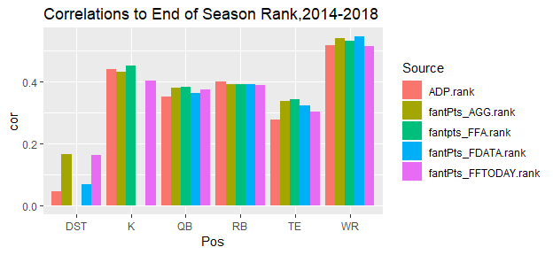
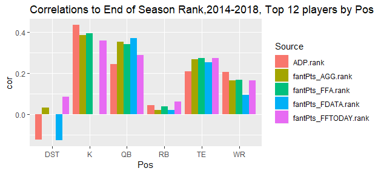
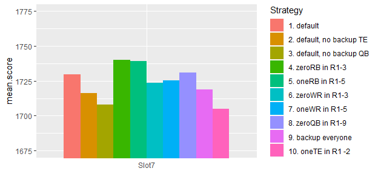

# Simulation and Optimization for Fantasy Football Drafts

In this post, I’ll use simulation and optimization to determine which
draft strategies will result in the best lineups for fantasy football.

In fantasy football, there’s a lot to consider when trying to figure out
an optimal draft strategy. Top RB’s have a high ceiling and the
potential to score 350 points, whereas top WRs can only reach 275
points, however top WR’s are usually seen as safer as they have a higher
correlation of their preseason to end of season rank. Positions like
DST, which have low ceiling and low pre-season correlation seem to be an
obvious choice to draft very late. There’s a lot of things to consider,
and I haven’t even mentioned other things like how you need to start a
different number of each position. Simulation is a good way to estimate
the effects of different strategies.

</br> </br>

## 1\. Organizing/Plotting the Data

The first thing I’ll do is organize/plot the data. I’m using season
projections from FantasyData.com, fantasyfootballanalytics.net, and
FFToday.com because they have archived projections available. I’m using
Average Draft Position (ADP) data from fantasyfootballcalculator.com
which shows where players were drafted each year. For all of this, I’m
using Half-PPR scoring and Yahoo defaults (1 QB, 2 RB, 2 WR, 1 TE, 1
RB/WR/TE, 1 DST, 1K). To start off I’ll look at some summary stats:

<!-- -->

From this chart, you can see that certain positions are easier to
project. DST expectedly is very hard to rank preseason so is an obvious
candidate to draft late. You can also see that the outside ranks have
similar predictive accuracy to ADP.Rank. AGG.rank is just the mean of
the outside ranks. This plot is a bit unfair though, because positions
with a larger sample size will have their correlation unfairly inflated
due to being able to rank further down into benchwarmer players. I’ll
reproduce the plot with the top 12 for each position:

<!-- -->

In addition, I’d also like to summarize the errors/variance:

<!-- -->

Above I show the distribution of errors for WRs, from 2008-2018. I am
going to use this when I make my draft strategy. I want to know based on
the projection and the Pos, how the error is distributed. Positive error
means they overperformed their projection. Now that the data is prepared
and summarized, I’m ready to test out a system.

</br> </br>

## 2\. Evaluating a Draft Strategy

After preparing the data and organizing estimated projections and
errors, I’m ready to test out draft strategies. I want something [like
this](https://fantasyfootballcalculator.com/draft-strategy/half-ppr/12-team/7-spot),
which shows how a different strategy in R1-3 will affect a draft’s
projected points. This is meant to let you see what positions you should
wait on drafting if you want to maximize your points. The thing that
isn’t accounted for in the above link though, is that in reality you
are not trying to maximize projected points of a full draft, but rather
for your eventual starting lineup, so you’re trying to pick the draft
that will give you the best eventual nine players.

My methodology consists of two functions: getPicks() and simSeason().

getPicks() takes in parameters like the slot you are drafting at, numRBs
to draft, numWR to draft, and you can fix/exclude players or positions
for each round as well. It then returns the draft which maximizes total
points of all the picks, given the specified parameters and
draft-position constraints. I show an example below, maximizing the
points for Slot7/12 in a 15 round
draft.

``` r
picks<-getPicks(slot="Slot7", data=all.data[all.data$Season==2019,], numTeams = 12,
                numRB=4, numWR = 5,numTE=2,numQB=2,numK=1, numDST=1)
```

    ##              Player Pos Team ADP_half ADP.Rank fantPts_AGG fantPts_AGG.bin Slot
    ## 6149    Julio Jones  WR  Atl     10.9     11.0      260.55       (250,400]    7
    ## 6156    Dalvin Cook  RB  Min     17.4     18.0      224.20       (200,250]   18
    ## 6178 Julian Edelman  WR  Nwe     39.4     40.0      204.80       (200,250]   31
    ## 6183   Chris Carson  RB  Sea     44.2     45.0      192.60       (150,200]   42
    ## 6194 Deshaun Watson  QB  Hou     54.6     56.0      328.92       (250,400]   55
    ## 6205    James White  RB  Nwe     64.2     67.0      178.70       (150,200]   66
    ## 6233   Lesean Mccoy  RB  Buf     92.2     95.0      149.75       (100,150]   79
    ## 6234            Chi DST  Chi     92.7     96.0      122.00       (100,150]   90
    ## 6243    Corey Davis  WR  Ten    100.9    105.0      145.20       (100,150]  103
    ## 6258 Dede Westbrook  WR  Jax    114.1    120.0      134.65       (100,150]  114
    ## 6285   Dak Prescott  QB  Dal    144.1    147.0      296.65       (250,400]  127
    ## 6289  Greg Zuerlein   K  Lar    146.7    151.0      143.00       (100,150]  138
    ## 6298     Greg Olsen  TE  Car    150.8    160.0      117.60       (100,150]  151
    ## 6310   Kyle Rudolph  TE  Min    157.2    172.5      119.55       (100,150]  162
    ## 6533   Mohamed Sanu  WR  Atl       NA    500.0      128.55       (100,150]  175

Above I display the optimal planned-draft given my parameters. You can
see how each player’s ADP.Rank must be greater than or equal to the slot
they are drafted at. </br>

The second function is simSeason() which takes in the above
planned-draft from getPicks(), and using the errors from earlier,
samples from the errors in the player’s corresponding
position/projection-bin to get a simulated score. Using this, I can then
sort by simulated score to get the starting lineup from my draft. You
only can put 9 players in your starting lineup and so if you have 2
amazing QBs in the simulated scores, only 1 will get into your simulated
starting lineup. In addition, I also simulate the scores of the
undrafted players, and I assume you are able to add the 4th-best
simulated undrafted player at each position. I made this assumption
because it is likely you will be lacking at 1-2 positions and so will be
able to get a decent player as a pickup for those positions.

Below you can see an example using the above picks:

``` r
set.seed(1)
topLineup<-simSeason(picks = picks, data=all.data, numSims=1,
                     numRB = 2, numWR=2, numFLEX = 1,  numQB=1, numTE = 1, numDST = 1, numK = 1   )
```

    ##            Player Pos Team ADP_half ADP.Rank fantPts_AGG fantPts_AGG.bin Slot      error      Sim Pickup
    ## 5  Deshaun Watson  QB  Hou     54.6       56      328.92       (250,400]   55  27.729750 356.6497      0
    ## 1     Julio Jones  WR  Atl     10.9       11      260.55       (250,400]    7  19.683333 280.2333      0
    ## 7    Lesean Mccoy  RB  Buf     92.2       95      149.75       (100,150]   79 107.307440 257.0574      0
    ## 3  Julian Edelman  WR  Nwe     39.4       40      204.80       (200,250]   31  24.565703 229.3657      0
    ## 13     Greg Olsen  TE  Car    150.8      160      117.60       (100,150]  151  89.385152 206.9852      0
    ## 4    Chris Carson  RB  Sea     44.2       45      192.60       (150,200]   42   7.255476 199.8555      0
    ## 6     James White  RB  Nwe     64.2       67      178.70       (150,200]   66 -34.826949 143.8731      0
    ## 12  Greg Zuerlein   K  Lar    146.7      151      143.00       (100,150]  138  -4.000000 139.0000      0
    ## 8             Chi DST  Chi     92.7       96      122.00       (100,150]   90   4.000000 126.0000      0

You can see from “error”, which players over and underperformed in the
sim, sampling the error from 2008-2018 data. Additionally, in the above
sim you see how Tennessee DST made it into the top starting lineup as a
pickup. I can now repeat simseason() many times, and so can get a mean
simulated-lineup-total-score for the planned picks. I used 2000 as my
simulation size as it seemed sufficient for the mean to converge.

``` r
topLineups<-simSeason(picks = picks, data=all.data, numSims=2000,
                      numRB = 2, numWR=2, numFLEX = 1,
                      numQB=1, numTE = 1, numDST = 1, numK = 1   )
summary(sapply(topLineups, function(x) sum(x$Sim)))
```

    ##    Min. 1st Qu.  Median    Mean 3rd Qu.    Max. 
    ##    1288    1649    1741    1744    1831    2190

</br> </br>

## 3\. Parameter Optimization

Now I’m ready to test different getPicks() parameters to see how I
should do my draft to get my the best mean-starting lineup. I included
arguments in the getPicks() function such as onePos and outPos which can
allow me to force positions in/out of rounds and experiment with
strategies like “have exactly one TE in Rounds 1-2” or “exactly zero RB
in Rounds 1-4”, or other things. I test out several parameter
combinations below for the 7th slot of a 12 team, 15 round draft.

<!-- -->

And there are the detailed parameters with each
    strategy:

    ##    Strategy.ID numRB numWR numTE numQB numK numDST  Constraints.Comments
    ## 1            1     4     5     2     2    1      1               default
    ## 2            2     5     5     1     2    1      1 default, no backup TE
    ## 3            3     5     5     2     1    1      1 default, no backup QB
    ## 4            4     5     4     2     2    1      1        zeroRB in R1-3
    ## 5            5     5     4     2     2    1      1         oneRB in R1-5
    ## 6            6     4     5     2     2    1      1        zeroWR in R1-3
    ## 7            7     4     5     2     2    1      1         oneWR in R1-5
    ## 8            8     4     5     2     2    1      1        zeroQB in R1-9
    ## 9            9     3     4     2     2    2      2       backup everyone
    ## 10          10     4     5     2     2    1      1        oneTE in R1 -2

<!-- </div> -->

<!-- </div> -->

Based on the above, you can see how certain strategies don’t really make
a difference, and certain ones perform worse. For example the zero-WR
strategies (6 & 7) perform about 50 points worse than the default
strategy. Not taking a backup TE and QB also worsen the score.

</br>

Finally, I reproduce this for all draft slots. Below you can see the
results, and how the best strategy is affected by your draft
slot.

<!-- --><!-- -->

</br>

The above plots are a bit messy, but if you look closely you can see
certain things that seem to make a difference. The 2nd and 3rd
strategies-not taking a backup QB and not taking a backup TE have a
negative effect, as the waiver wire adds apparently are not sufficient
backup. In addition, for almost every slot the zero-RB (4&5) seems to
perform better than zero-WR (6&7). This is especially true in the
mid-late slots where it seems like the zero-WR does much worse.

This is just for Half-PPR 12 man leagues, and the results might change
with different scoring but it at least is an attempt to quantitatively
evaluate strategies.

</br> </br>

## 4\. Conclusion

Looking at the strategies, many of them perform similarly, finishing
within 10-20 points. A couple did do worse, for example the zero-WR does
considerably worse than zero-RB for people with mid-late slots in the
draft, meaning you should likely take some WRs in the first few rounds.
For these mid-late slots, zero-WR in R1-3 often performed 50 points
worse than a zero-RB in it’s mean simulated starting lineup, which is
basically like drafting Derrick Henry over Melvin Gordon in R1, and so
it isn’t insignificant. If a league requires 3 WRs to start then this
early RB strategy likely becomes even worse. Other parameter changes
like taking backup TE/QBs also have a decent 10-20 point impact across
draft slots.

Another takeaway is that projections have been about as accurate as ADP.
People often assume analytics will automatically give them an edge, but
often times public consensus or human rankings can be as accurate or
more accurate than an analytical model. I wouldn’t just go by a
projection model or trust someone until I’ve seen it is proven to be
useful, even if they try to make it sound complex. WRs do appear to be
somewhat easier and so it might make sense to work on a model for them
or find someone who has an accurate one.

Finally, there are a couple shortcomings with my method. Firstly, I am
not accounting for opponent probabilistic picking i.e. the fact that you
don’t know exactly where a player will be picked. For simplicity I left
this out. I think estimating a single draft like I did at least shows
you things like the effect of going RB early and WR late, and keeps it
simpler, despite the available players not being exact. Accounting for
this though would be complicated as I’d have to return a set of
potential drafts with getPicks() instead of a single draft, so I wanted
to keep it simple for now.

The second main shortcoming I think is that the optimal strategy
determined by the system will be dependent on the projections. For
example, if there is a WR that is projected as hugely undervalued in the
10th round, then doing a WR early-RB late strategy will look bad because
I am missing out on that value. I think this is something I should look
into. Having said that, things like taking a backup QB/TE do seem like
they’d be less affected by this. An interesting idea would be to create
an entirely ADP-based projection model so that I can see how the optimal
strategy would be regardless of projection system i.e. if there are no
sleepers.

TLDR: Most strategies did similarly. It does seem that you should take a
backup TE and QB. In addition, zero-WR strategy does not seem like a
good move, especially if you are in the mid-late picks of the draft, so
I’d try to draft at least 1 WR in the first few rounds. Other than that
I haven’t found any shocking secrets yet that will give me a huge edge.
Thanks for reading\!
